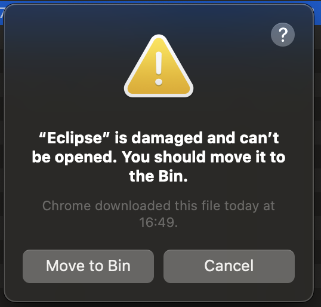
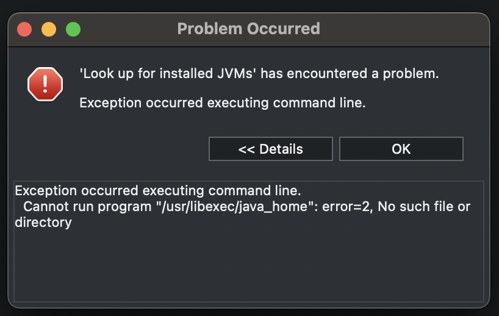
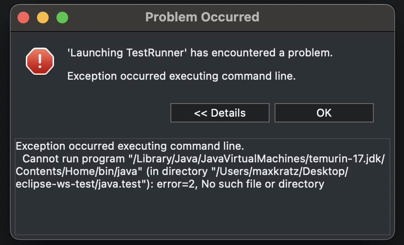

# How to run a custom Eclipse on macOS

(Apparantly, this was successfully tested on AMD64-based and ARM64-based Macs.)

## Problem

If you just run a custom Eclipse without further configuration on modern macOS systems, you will propably get one of the following error messages:

## Solution

The following steps are necessary to run a custom Eclipse on modern macOS systems.

- Allow your Terminal the privileges to `Full Disk Access` and `Developer Tools` in the `Settings` app of macOS.
    - `Settings` -> `Privacy & Security` -> `Full Disk Access` -> Add `Terminal` app and/or toggle its setting to `on`.
    - `Settings` -> `Privacy & Security` -> `Developer Tools` -> Add `Terminal` app and/or toggle its setting to `on`.
- Install the recommend JDK, e.g., [Eclipse Temurin JDK 17](https://adoptium.net/de/temurin/releases/?os=mac&arch=x64&package=jdk&version=17).
- Download the custom Eclipse archive (e.g., from https://emoflon.org or GitHub).
- Extract it with a double click.
- Right click on `Eclipse.app` -> `Show Package Contents` -> Navigate into `Contents`.
- Open `Info.plist` with a text editor of your choice (e.g., [VSCodium](https://vscodium.com/)).
- Open a Terminal window and run `$ /usr/libexec/java_home`
    - This should return you a single path to your default Java JDK installation, e.g., `/Library/Java/JavaVirtualMachines/temurin-17.jdk/Contents/Home`
- Leave your Terminal window open and return to your text editor (showing the contents of `Info.plist`). Scroll down into the block below the line `<key>Eclipse</key>` and enter your Java JDK's path with this syntax: `<string>-vm</string><string>$YOUR_PATH/bin/java</string>`
    - Example: `<string>-vm</string><string>/Library/Java/JavaVirtualMachines/temurin-17.jdk/Contents/Home/bin/java</string>`
- Save the file, close your editor, and open your Terminal window again.
- Navigate the Terminal window to your Eclipse folder using `cd $FOLDER_NAME`, e.g., `cd Downloads/eclipse`.
    - Verify that your custom `Eclipse.app` is located in the currently selected folder via `ls`.
- Sign the modified `Eclipse.app` with this command: `$ sudo codesign --force --deep --sign - ./Eclipse.app`
    - When requested, type in the password of your user account and hit enter.
- Run `$ xattr -d com.apple.quarantine ./Eclipse.app` within the Terminal.
- As for the `Terminal` app, add the privileges for `Full Disk Access` and `Developer Tools` to your `Eclipse.app`.

You can now start your custom `Eclipse.app` with a double click on it.
If macOS asks if you really want to start the "broken" app, select `Run`.

All modifications on the local `Eclipse.app` can also be made with [this script](../scripts/fix-eclipse-app-macos.sh).

---

## Currently known issues

... besides the hustle to get Eclipse running.

- Custom eMoflon settings will not be honored.
    - The default *perspective* is not the *eMoflon perspective*.
    - The default workspace encoding may not be *UTF8*.
    - The default git clone path is not `${workspace_loc}/git` as required to run eMoflon.

---

## References/Pointers to useful websites

- https://stackoverflow.com/questions/70725347/the-application-eclipse-can-t-be-opened-macos-monterey/71740449#71740449
- https://www.eclipse.org/forums/index.php/t/1106695/
- https://forums.developer.apple.com/forums/thread/684509
- https://forums.developer.apple.com/forums/thread/673057
- https://stackoverflow.com/questions/44872071/removing-the-code-signature-from-a-mac-app-executable
